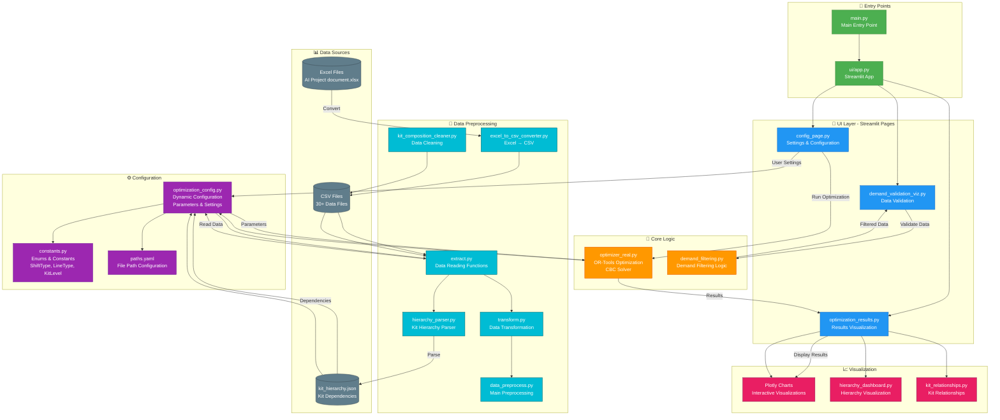
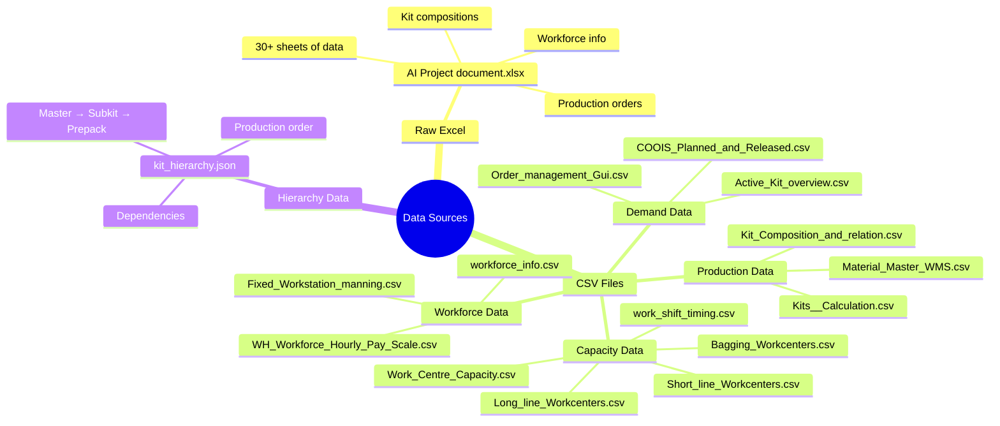
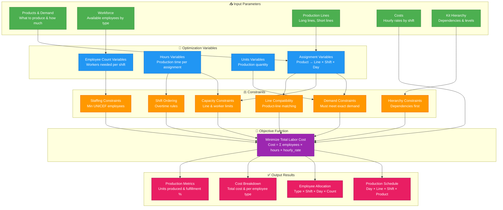
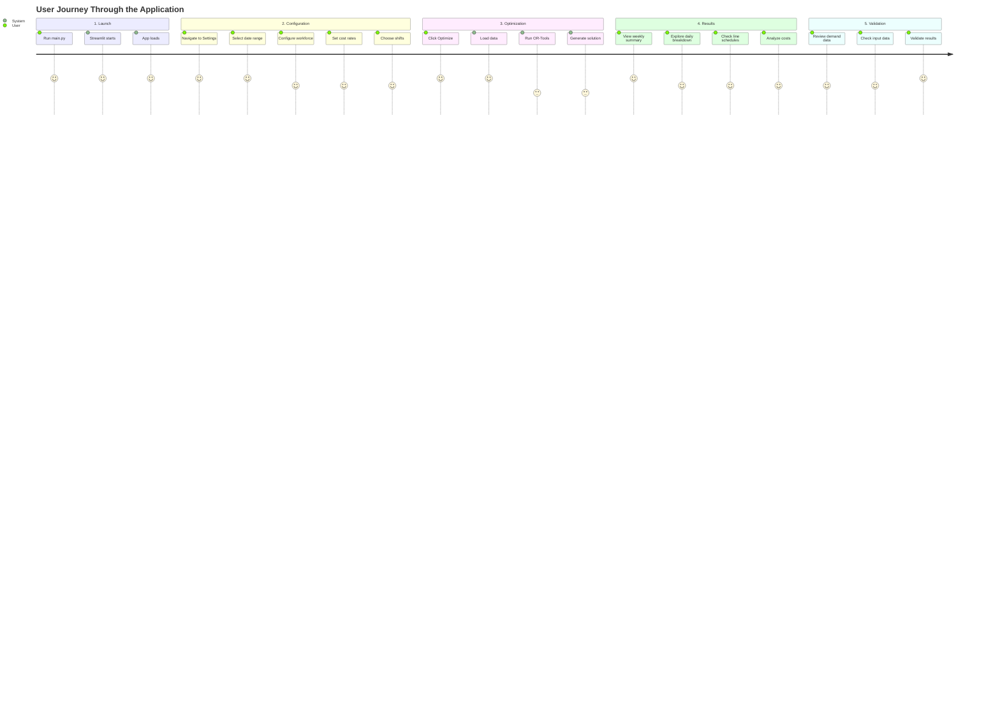
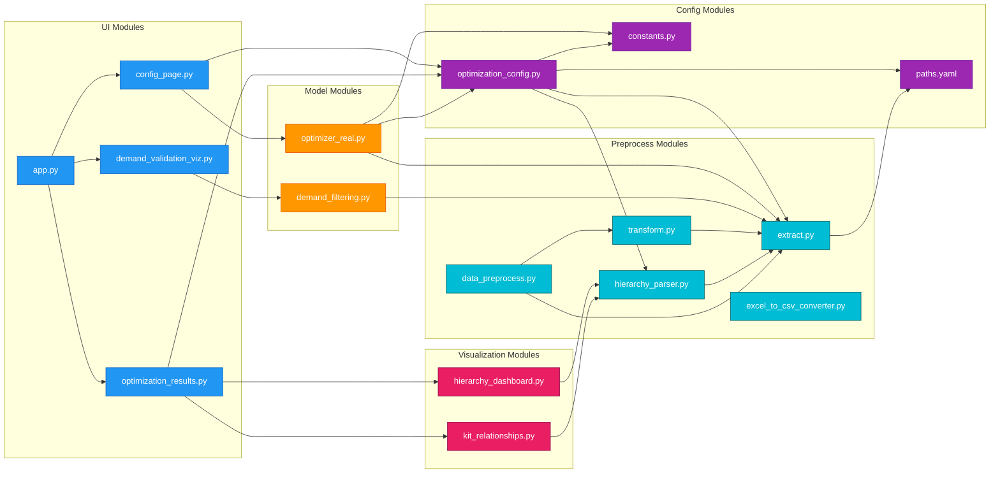
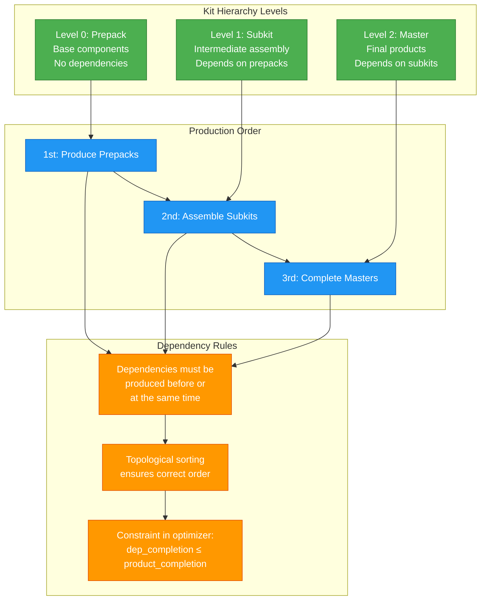
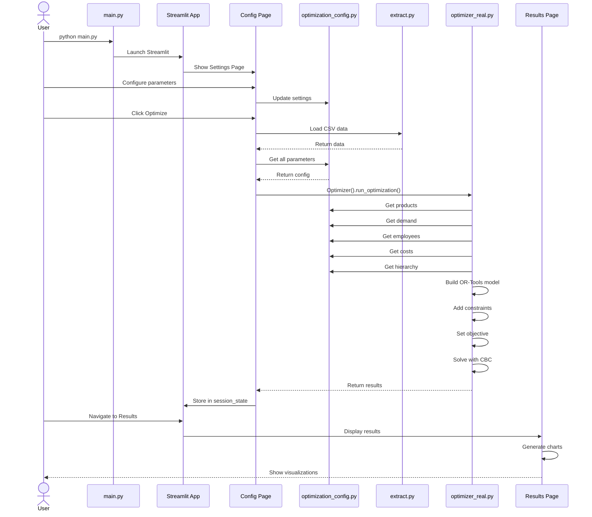
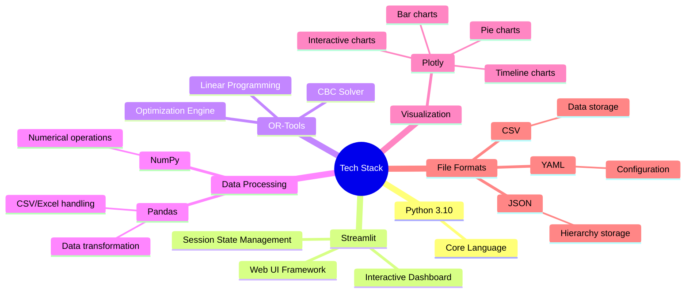

# 🏗️ Supply Roster Optimization Tool - Architecture Diagram

## 📋 System Overview

This document provides a comprehensive architectural overview of the Supply Roster Optimization Tool, including all system components, data flows, and interconnections.

---

## 🎯 High-Level Architecture



---

## 🔄 Data Flow Details

```mermaid
flowchart LR
    subgraph "1️⃣ Data Ingestion"
        A1[Excel Files] -->|excel_to_csv_converter.py| A2[CSV Files]
        A2 -->|hierarchy_parser.py| A3[kit_hierarchy.json]
    end

    subgraph "2️⃣ Data Processing"
        B1[extract.py<br/>Read Functions]
        B2[transform.py<br/>Transform Logic]
        B3[data_preprocess.py<br/>Main Processing]
        
        A2 --> B1
        B1 --> B2
        B2 --> B3
        A3 --> B1
    end

    subgraph "3️⃣ Configuration"
        C1[optimization_config.py]
        C2[Dynamic Parameters:<br/>- Products<br/>- Demand<br/>- Employees<br/>- Costs<br/>- Hierarchy]
        
        B3 --> C1
        C1 --> C2
    end

    subgraph "4️⃣ Optimization"
        D1[optimizer_real.py]
        D2[OR-Tools CBC Solver]
        D3[Variables:<br/>- Assignment<br/>- Hours<br/>- Units<br/>- Employee Count]
        D4[Constraints:<br/>- Demand<br/>- Capacity<br/>- Dependencies<br/>- Staffing]
        
        C2 --> D1
        D1 --> D2
        D2 --> D3
        D3 --> D4
    end

    subgraph "5️⃣ Results"
        E1[Optimization Results:<br/>- Schedule<br/>- Production<br/>- Costs<br/>- Headcount]
        E2[Visualization:<br/>- Charts<br/>- Tables<br/>- Analysis]
        
        D4 --> E1
        E1 --> E2
    end

    style A1 fill:#607D8B,color:#fff
    style A2 fill:#607D8B,color:#fff
    style A3 fill:#607D8B,color:#fff
    style B1 fill:#00BCD4,color:#fff
    style B2 fill:#00BCD4,color:#fff
    style B3 fill:#00BCD4,color:#fff
    style C1 fill:#9C27B0,color:#fff
    style C2 fill:#9C27B0,color:#fff
    style D1 fill:#FF9800,color:#fff
    style D2 fill:#FF9800,color:#fff
    style D3 fill:#FF9800,color:#fff
    style D4 fill:#FF9800,color:#fff
    style E1 fill:#2196F3,color:#fff
    style E2 fill:#E91E63,color:#fff
```



---

## 📦 Key Data Files & Their Purpose



---

## 🧮 Optimization Model Components



---

## 🎨 UI Components & User Flow



---

## 🔍 Module Dependency Graph



---

## 📊 Kit Hierarchy System



---

## 🚀 Execution Flow



---

## 🔑 Key Technologies & Libraries



---

## 📝 Configuration Files

### paths.yaml
Centralized file path management:
- CSV file paths
- Excel file paths
- Hierarchy JSON paths

### optimization_config.py
Dynamic optimization parameter management:
- Product list (`get_product_list()`)
- Demand data (`get_demand_dictionary()`)
- Employee types (`get_employee_type_list()`)
- Cost information (`get_cost_list_per_emp_shift()`)
- Kit hierarchy (`KIT_LEVELS`, `KIT_DEPENDENCIES`)
- Line configuration (`get_line_list()`, `get_line_cnt_per_type()`)
- Shift configuration (`get_active_shift_list()`)

### constants.py
Constants and Enum definitions:
- `ShiftType`: Regular(1), Evening(2), Overtime(3)
- `LineType`: Long Line(6), Short Line(7)
- `KitLevel`: Prepack(0), Subkit(1), Master(2)

---

## 💡 Key Features

### 1. Dynamic Configuration
- All parameters can be dynamically configured from the UI
- State management with session state
- Real-time data loading

### 2. Hierarchy-Based Optimization
- 3-level hierarchy structure (Prepack → Subkit → Master)
- Automatic dependency constraint application
- Production order determined by topological sorting

### 3. Multi-Shift Scheduling
- Support for Regular, Evening, and Overtime shifts
- Different cost rates per shift
- Bulk/Partial payment mode selection

### 4. Comprehensive Visualization
- Weekly production summary
- Daily employee allocation
- Line-by-line schedules
- Cost analysis
- Hierarchy structure visualization

### 5. Data Validation
- Demand data verification
- Input data validation
- Feasibility checks

---

## 🎯 Optimization Objective

**Goal**: Minimize Total Labor Cost

```
Minimize: Σ (employee_type, shift, day) [ 
    hourly_rate × hours_worked × employees_count 
]
```

**Subject to Constraints**:
1. **Demand Fulfillment**: Must produce exactly the weekly demand for each product
2. **Capacity Limits**: Line and shift hour limitations
3. **Hierarchy Constraints**: Dependencies must be produced first
4. **Staffing Constraints**: Daily employee availability limits by type
5. **Line Compatibility**: Product-line type matching
6. **Shift Ordering**: Overtime only when Regular is at 90%+ capacity
7. **Minimum Staffing**: Guaranteed minimum UNICEF employees

---

## 📈 Performance Considerations

### OR-Tools CBC Solver
- **Pros**: Free open-source, commercial-use allowed, reasonable performance
- **Cons**: Can be slow on large-scale problems
- **Optimizations**: 
  - Minimize variable count
  - Efficient constraint formulation
  - Pre-filtering to eliminate unnecessary combinations

### Data Loading
- **CSV Caching**: Use Streamlit `@st.cache_data`
- **Session State**: Store optimization results
- **Lazy Loading**: Load only required data

---

## 🔧 Future Enhancement Opportunities

1. **Database Integration**: CSV → PostgreSQL/MySQL
2. **Advanced Solver**: CBC → Gurobi/CPLEX for faster solving
3. **Real-time Updates**: WebSocket for live optimization status
4. **Machine Learning**: Demand forecasting, production time prediction
5. **Multi-objective**: Consider completion time, resource utilization beyond cost
6. **Parallel Processing**: Run multiple scenarios simultaneously
7. **Export Features**: PDF reports, Excel result exports

---

## 📚 Documentation Structure

```
SD_roster_real/
├── README.md                    # Project overview and quick start
├── ARCHITECTURE_DIAGRAM.md      # This file - architecture diagrams
├── requirements.txt             # Python dependencies
├── setup.py                     # Package setup
│
├── main.py                      # Main entry point
│
├── ui/                          # Streamlit UI
│   ├── app.py                   # Main app
│   └── pages/                   # Page components
│
├── src/                         # Core business logic
│   ├── config/                  # Configuration management
│   ├── models/                  # Optimization models
│   ├── preprocess/              # Data preprocessing
│   └── visualization/           # Chart generation
│
├── data/                        # Data files
│   ├── real_data_excel/         # Original Excel files
ㄱ│   │   └── production_data/       # Converted CSV files
│   └── hierarchy_exports/       # Hierarchy JSON structures
│
└── notebook/                    # Jupyter notebooks (for analysis)
```

---

## 🎓 Learning Path

Recommended order for understanding this project:

1. **Start**: `README.md` - Project overview
2. **Run**: `main.py` → `ui/app.py` - Run the application
3. **UI**: `ui/pages/config_page.py` - Understand UI structure
4. **Config**: `src/config/optimization_config.py` - Configuration system
5. **Data**: `src/preprocess/extract.py` - Data loading
6. **Core**: `src/models/optimizer_real.py` - Optimization logic
7. **Results**: `ui/pages/optimization_results.py` - Results visualization
8. **Architecture**: This file - Big picture understanding

---

## 📞 Component Interaction Summary

| Layer | Components | Purpose | Key Technologies |
|-------|-----------|---------|-----------------|
| **Entry** | main.py, app.py | Application launch | Python, Streamlit |
| **UI** | config_page, optimization_results, demand_validation_viz | User interface | Streamlit, Plotly |
| **Core** | optimizer_real, demand_filtering | Business logic | OR-Tools, NumPy |
| **Config** | optimization_config, constants, paths | Configuration | Python, YAML |
| **Preprocess** | extract, transform, hierarchy_parser | Data preparation | Pandas, JSON |
| **Data** | CSV files, JSON files | Data storage | CSV, JSON |
| **Viz** | Plotly charts, hierarchy_dashboard | Visualization | Plotly, Matplotlib |

---

## ✅ Conclusion

The Supply Roster Optimization Tool features:

- **Modular Architecture**: Clear separation of layers
- **Dynamic Configuration**: All parameters adjustable from UI
- **Powerful Optimization**: Complex constraints handled by OR-Tools
- **Intuitive Visualization**: Clear result presentation with Plotly
- **Extensible Design**: Easy to add new features

The entire system operates as a pipeline: **Data Collection → Preprocessing → Configuration → Optimization → Result Display**
