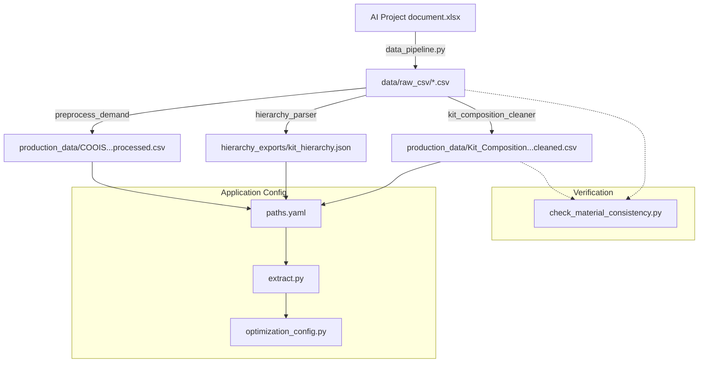

# Data Pipeline & Workflow Documentation

This document outlines the current data pipeline, identifying critical files, their sources, and the workflow required to update data.

## 1. Directory Overview & Critical Files

### `data/real_data_excel`
This is the **primary entry point** for raw data.
- **Critical Source:** `AI Project document.xlsx`
    - This Excel file contains the master data for almost all downstream CSVs.
    - **Key Sheets:** `COOIS Planned and Released`, `Kit Composition`, `Workforce`, `Capacity`, `Material Master`.

### `data/real_data_excel/production_data`
This is the **active data directory** used by the application code (`src`). The application reads from here (configured in `paths.yaml`).
- **Active Files (Used by App):**
    - `COOIS_Planned_and_Released_processed.csv` (Demand Data)
    - `Kit_Composition_and_relation_cleaned_with_line_type.csv` (Cleaned BOM)
    - `WH_Workforce_Hourly_Pay_Scale_processed.csv` (Workforce Data)
    - `work_shift.csv` (Shift Data)
    - `Work_Centre_Capacity_processed.csv` (Capacity Data - *Critical: Contains `line_for_packaging`*)
    - `Material_Master_WMS.csv` (Material Master)
    - `Kits__Calculation_260115.csv` (Throughput/Speed Data)

### `data/hierarchy_exports`
Generated outputs derived from the cleaned CSVs.
- **Generated File:** `kit_hierarchy.json` (via `hierarchy_parser.py`)

---

## 2. Configuration & Constants

The data pipeline connects to the application implementation via configuration files:

1.  **`src/config/paths.yaml`**: Definitive source of file paths. The pipeline validates that the files generated exist at these paths.
    -   *Dependency:* `src/preprocess/extract.py` reads this to load dataframes.
2.  **`src/config/optimization_config.py`**: Loads data using `extract.py` and establishes runtime configurations (e.g., getting the list of products from the loaded demand).
3.  **`src/config/constants.py`**: Defines static constants references by the configuration and pipeline (e.g., shift names, line types).

## 3. Orchestrated Data Flow

The entire workflow is now orchestrated by `src/preprocess/data_pipeline.py`.



## 4. Update Procedure

**Usage Options:**

Run the entire pipeline (default):
```bash
python3 src/preprocess/data_pipeline.py
```

Run specific steps only:
```bash
# Convert Excel to CSV only (Step 1)
python3 src/preprocess/data_pipeline.py --excel-to-csv

# Process Kit Composition only (Step 2)
python3 src/preprocess/data_pipeline.py --kit

# Generate Hierarchy only (Step 3)
python3 src/preprocess/data_pipeline.py --hierarchy

# Preprocess Demand only (Step 4)
python3 src/preprocess/data_pipeline.py --demand

# Run Consistency Check only (Step 5)
python3 src/preprocess/data_pipeline.py --consistency

# Verify Paths only (Step 6)
python3 src/preprocess/data_pipeline.py --verify
```

**What this does (orchestration logic):**
1.  **Arguments:** Accepts flags for each step. If NO flags are provided, it defaults to running `--all`.
2.  **Step 1:** Converts all Excel sheets to CSVs in `data/raw_csv`.

2.  Cleans the Kit Composition file.
3.  Regenerates the Kit Hierarchy JSON.
4.  Preprocesses the Demand data (`COOIS_Planned_and_Released.csv` -> `processed`).
5.  **Runs Material Consistency Check** to ensure all materials in demand exist in kit composition.
6.  Verifies all output files exist as expected by `paths.yaml`.

