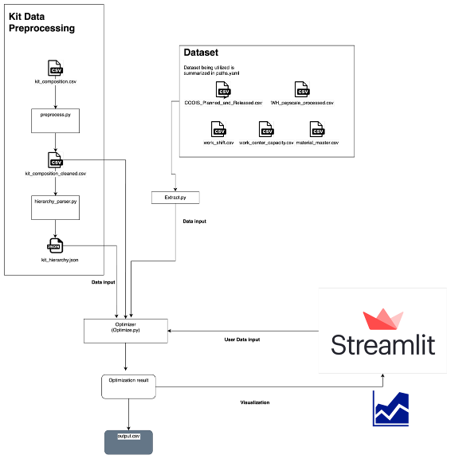

# Model Card for Warehouse Workforce Roster Optimizer

This model is a linear optimizer of workforce rosters used to determine the cost of packing kits in the UNICEF Supply Division Warehouse. The model was developed by the UNICEF Office of Innovation Ventures data science team in conjunction with stakeholders from the Supply Division Warehouse unit following a mission to the Warehouse in April 2025.

- **Developed by:** Frontier Tech Unit Data Science team, Office of Innovation-Ventures
- **Funded by:** Office of Innovation-Ventures
- **Shared by:** Office of Innovation-Ventures
- **Model type:** Mixed integer optimization using branch and cut method
- **Language(s) (NLP):** English
- **License:** {{ license | default("[More Information Needed]", true)}}


## Model Details

The model generates combinations of workforce types and schedules under scenarios specified by the user. The underlying model is a mixed integer linear optimizer subject to constraints that embody the scenario. It uses Branch and cut method. See complete list of parameter constraints in the section below.


### Model Description

The model supports a scenario analysis tool that can generate optimized workforce roster schedules based on criteria provided by the UNICEF-Supply Division Warehouse unit. Outputs of this model include workforce assignments by shift and by day

Workforce rosters include Fixed-Term staff, temporary appointment staff and contract workers from a labour-hire contractor (i.e. humanizers) and workers from a process control engineering company. The volume of daily staff needs is influenced by several different parameters including (but not limited to), amount and types of products in demand,output capacity of the equipment(lines), and activated shift. 

Users can configure parameter constraints for the optimizer including:
<!-- - prioritization of fixed-term staff -->
- Daily workforce limits (i.e., maximium and minimum number of UNICEF fixed-term staff per day, maximum number of humanizer staff per day) #This is work in progress.
- Daily working hours limits (i.e. maximum number of hours worked per person per day, maximum hours per shift including regular hours, evening hours and overtime time slots)
- Production line limits (i.e. number of long lines, maximum workers per long line, number of mini load lines, maxmimum of workers per mini load lines)
- Payment mode (i.e. whether to pay the employee in bulk for the entirety of the shift if work any hours in the shift or partially for actual hours worked)
- Hourly rates for UNICEF fixed-term staff and humanizer according to shift
- Data selection for whether to include certain employee types, shift types (regular, evening and/or overtime), and production lines (long lines and/or miniload)
- Number of days to process the given demand (Production dates)
- Available shift


### Model Sources

<!-- Provide the basic links for the model. -->

- **Repository:** {{ [repo](https://github.com/UNICEF-Ventures/SupplyDivision_Roster_Management), true)}}
- **Paper:** {{[Google OR-Tools LP Problem](https://developers.google.com/optimization/lp/lp_example)", true)}}
- **Demo:** {{ [demo](https://supplydivision-roster-management-757875755025.europe-north2.run.app/), true)}} #the demo will be available only until the end of 2025.

## Uses

This model is intended to be used by Supply Division Warehouse Managers or supervisors wanting to optimize workforce rosters under different constraints to support roster decisionmaking. 


<!-- Address questions around how the model is intended to be used, including the foreseeable users of the model and those affected by the model. -->

### Direct Use

This model can be used by Warehouse supervision staff without fine-tuning or adapting by following the main README. Additional features and contraints can be included in the future.
<!-- This section is for the model use without fine-tuning or plugging into a larger ecosystem/app. -->


### Out-of-Scope Use

This should not be used for purposes other than generating scenarios of workforce arrangements under prescribed constraints. 
This model should not be used for forecasting purposes.


## Bias, Risks, and Limitations

- The scenarios of workforce configurations generated are subject to the maximal constraints set by the user. Therefore, workforce capacity cannot be interpreted to go beyond the constraints. 

- This tool only manages the kit packaging, not other functionalities. There are other components such as purchasing but this tool does not consider those factors.

- There is no time built in for between shifts or kit packaging. 
- The tool does not account for external factors such as exhaustion or over-extending of workforce.

- The tool is strictly based on the employee productivity information in AI project document.xlsx provided by the supply division. As there is no information on the productivity of each workers and the relative productivity between humanizers and unicef staff, it does not consider those factors.


## How to Get Started with the Model

Please refer to the [Quick Start section](../README.md#-quick-start) in the README for detailed installation and usage instructions.


#### Speeds, Sizes, Times [optional]

- Time limit: 60 s.
- Result: best feasible integer solution found within the limit.
- Quality: stops early if the relative gap ≤ 1% to the best continuous-relaxation bound; otherwise returns the best incumbent at timeout.

<!-- This section provides information about throughput, start/end time, checkpoint size if relevant, etc. -->


## Technical Specifications [optional]

### Model Architecture and Objective

#### 1. Algorithm & methodology 

This optimization tool uses OR-tool package in python to build a mixed linear integer optimizer. 
Mixed linear integer optimization is a optimizer where continuous and discrete (integer) variables both are present within a single optimization problem. 

This tool specifically uses a methodlogy called Branch and cut.
It first assumes that all the variables are continuous and finds the optimal solution. 
Starting from that optimal point, an integer near that point is explored by being converted into a boundary. 
Details of the method can be found in the resources below :

[Related youtube lecture](https://youtu.be/upcsrgqdeNQ?si=eXlxMbdI7CH3SqY_)
[Related introduction on CBC](https://coin-or.github.io/Cbc/intro.html)


#### 2. Objective function

The objective function is to minimize the sum of labor cost.
The labor cost is calculated as sum of wage per hour for each employee type multiplied by working hours.
Working hours can be calculated in two different ways. 

1) When the model is partial payment mode - where the employees are discharged once they finish the assigned work : It is based on the actual hours needed to package the target amount of kits. 

2) When the model is bulk payment mode - where the employees should stay in the work place even when the work is finished : it is based on the full length of the shift.

#### 3. Processing flows

##### 0. Data pipeline

It currently uses data from excel file but current architecture is also compatible with database operation as well.


***Dataset*** : Data is plugged in as 
- csv files in the 
- configurations that is saved as session state.
- Constants saved in the constants.py

Detail on the data pipeline is outlined in "data pipeline" section below.


##### 1. Demand validation

- Demand validation is to explore the data integrity problem such as missing data points and summarize the included demand and excluded demand.
- Using `demand_validation_viz.py`, demand is validated and visualized in the ui. 


##### 2. Processing dependencies

- `hierarchy_parser.py` has `parse_hierarchy` function.  This function parse `Kit_Composition_and_relation` into `kit_hierarchy.json`

- extract.py has get_production_order_data function, which aligns the kit id into order (prepack, subkit) and process product list, dependencies and kit levels into lists.

 - `hierarchy_parser.py` has `sort_products_by_hierarchy` function, that sorts the kits starting from prepack to subkit. This sorting however does not affect the optimization.

 - In the line within `optimizer_real.py` starting from 
 `print("\n[HIERARCHY] Adding dependency constraints (only for valid combinations)...")` 

 The code adds a constraint that for each product, dependencies should finish earlier than the product. 

```
p_completion = solver.Sum(t * Hours[p, ell, s, t] for p_iter, ell, s, t in valid_combinations if p_iter == p) dep_completion = solver.Sum(t * Hours[dep, ell, s, t] for dep_iter, ell, s, t in valid_combinations if dep_iter == dep)
```


##### 3. Line assignment

- Using `kit_composition_cleaner.py` file, the Kit_composition_and_line_type data that is given by supply division is assigned a proper linetype considering the standalone/non-virtual masterkit as well.
(`data_preprocess.py` should be deleted at some point as not being used)


##### 4. Optimization

- The optimization is conducted in `optimizer_real.py` file


##### 5.Reports and visuzlization

There are two types of report
1) Pre optimization report - this aims to give a preview of the demand, feasiblity, and the configuration.

2) Optimization report - this aims to show the detailed analysis of the optimization result once we have the optimization report based on the input data and configurations.

Details of the report can be found [here](https://unicef.sharepoint.com/:p:/t/OOI-Venture/EV0zSSzinb9NnGIKTPKImQ4BZGrNtIl6crLJ-c2cuE93Sg?e=pXxPcw)


#### 4. Optimization Mathematical equation

##### 1. Solve Policy (time & gap)
- **Time limit:** 60 seconds  
- **Early stop:** terminate if the **relative gap ≤ 1%** to the **continuous-relaxation (dual) bound**  
- **Returned solution:** best feasible **integer** incumbent at stop time  
```
- *(Minimization)* `gap = (z_inc − z_bound) / |z_inc| ≤ 0.01`  
- *(Maximization)* `gap = (z_bound − z_inc) / |z_inc| ≤ 0.01`
```

---

##### 2. Notation

**Sets**
- `P` products (`p ∈ P`)
- `L` lines (`ell ∈ L`)
- `S` shifts (`s ∈ S`, e.g., `REGULAR`, `EVENING`, `OVERTIME`)
- `T` days (`t ∈ T`)
- `E` employee types (`e ∈ E`)

**Parameters**
- `Hmax_s[s]` — available hours in shift `s`
- `TEAM_REQ_PER_PRODUCT[e][p]` — staff of type `e` required when producing product `p`
- `speed[p, ell]` — units/hour for product `p` on line `ell` *(omit constraints if unknown)*
- `demand[p, t]` — required units of `p` on day `t`
- `max_employee_type_day[e][t]` — max available employees of type `e` on day `t`
- `FIXED_MIN_UNICEF_PER_DAY` — daily minimum for `'UNICEF Fixed term'` on `REGULAR`
- `min_regular_for_overtime` — threshold of regular usage before overtime allowed
- `regular_capacity` — cap linking overtime usage to regular capacity
- `Compat[p, ell] ∈ {0,1}` — 1 if product `p` can run on line `ell`
- `epsilon` — small positive constant (e.g., `1e-4`)
- `cost[e][s]` — cost per employee-hour of type `e` on shift `s`

**Decision variables**
- `Hours[p, ell, s, t] ≥ 0` — hours of `p` on `ell` during shift `s` of day `t`
- `Units[p, ell, s, t] ≥ 0` — units of `p` produced on `ell, s, t`
- `IsProducedOnLine[p, ell, s, t] ∈ {0,1}` — whether `p` is produced on `ell, s, t`
- `MaxEmployeesOnLine[e, ell, s, t] ∈ ℤ₊` — employees of type `e` staffed on `ell, s, t`
- `EMPLOYEE_COUNT[e, s, t] ∈ ℤ₊` — total employees of type `e` on shift `s`, day `t`
- `using_overtime[e, t] ∈ {0,1}` — whether overtime is used for type `e` on day `t`

**Derived expressions (not variables)**
```
`EMPLOYEE_HOURS[e, s, t] = Σ_{p, ell} TEAM_REQ_PER_PRODUCT[e][p] * Hours[p, ell, s, t]`
`total_employees_needed[e, s, t] = Σ_{ell} MaxEmployeesOnLine[e, ell, s, t]`
```


---

##### 3 Objective

**Bulk labor cost (current)**

minimize  
```
Σ_{e, ell, s, t} cost[e][s] * Hmax_s[s] * MaxEmployeesOnLine[e, ell, s, t]
```

**Partial components (to be implemented)**
- Add additional cost terms as needed (e.g., overtime premiums, shortage penalties, unmet-demand penalties).


Additional solver parameters were added to explore the solution faster and avoid time-out errors. 

This includes
- "sec:300"
- "ratioGap:0.01"
- "allowableGap:100"
- "maxSol:1"
- "maxN:2000"
- "presolve:on"
- "cuts:off"
- "heur:on"
- "passC:1"
- "passF:5"
- "passP:1"
- "pumpC:0"


<detail>

<summary>Parameters for fast search</summary>
#### 1. Stopping conditions (time & gaps)

- `sec:300`  
  • **Wall-clock time limit** = 300 seconds.  
  • When time expires, the solver **returns the best incumbent** (feasible integer solution) and the best **bound** from the continuous relaxation/tree.

- `ratioGap:0.01`  
  • **Relative optimality gap** target = 1%.  
  • Minimization: `gap = (z_inc - z_bound) / max(1, |z_inc|) ≤ 0.01`  
    Maximization: `gap = (z_bound - z_inc) / max(1, |z_inc|) ≤ 0.01`  
  • Here `z_bound` is typically the best **continuous-relaxation (dual) bound** improved by cuts and branching; `z_inc` is the best integer incumbent.

- `allowableGap:100`  
  • **Absolute gap** target = 100 (same units as the objective).  
  • Stop when `|z_inc - z_bound| ≤ 100`, even if the relative gap is larger.

> **Note:** Stopping rules are effectively **OR**ed: the run ends as soon as **time limit OR relative gap OR absolute gap** is satisfied.

---

#### 2. Search limits (solutions & nodes)

- `maxSol:1`  
  • Stop after **the first feasible solution** is found.  
  • Good for “get something quickly”, but you may stop **before** the gap targets are met.

- `maxN:2000`  
  • **Node limit** = 2,000 branch-and-bound nodes.  
  • Caps tree size if you want to avoid deep searches; may end before reaching gap/time targets.

---

#### 3. Presolve & structural simplification

- `presolve:on`  
  • Enable **presolve** to tighten/clean the model before tree search.  
  • Typical actions: bound tightening, redundant row removal, coefficient strengthening, variable fixing, probing, aggregation.  
  • Usually **reduces** problem size and **strengthens** the root LP relaxation.

- `passP:1`  
  • Number of **presolve passes**.  
  • More passes (`3–5`) can further shrink/strengthen, at some upfront cost; `1` is faster to start.

---

#### 4. Cut generation (the “cut” in branch-and-cut)

- `cuts:off`  
  • Turn **off** cut separation.  
  • The algorithm degenerates toward **plain branch-and-bound**; the **LP bound stays weak**, gaps close slowly, more nodes are needed.  
  • In most cases, leave cuts **on** for faster gap closing.

- `passC:1`  
  • Number of **cut rounds at the root** (sometimes also affects subsequent nodes).  
  • More rounds (`5–20`) usually give a **stronger bound** (smaller initial gap), at the cost of extra root time.

---

#### 5. Heuristics (quick feasible solutions)

- `heur:on`  
  • Enable primal **heuristics** (e.g., rounding, feasibility pump, local search).  
  • Purpose: get a **good incumbent early** so the relative gap is meaningful and search can prune more aggressively.

- `passF:5`  
  • Number of **Feasibility Pump** iterations/rounds (a specific primal heuristic).  
  • Higher values try harder to find a feasible integer, but can spend more time at the root.

- `pumpC:0`  
  • Feasibility-pump cutoff/tuning constant (implementation-specific).  
  • Usually kept at default; advanced users may tweak when pump convergence is odd.

</detail>

##### 4. Constraints

**Activation & linking**

- **[C1] Produce ⇒ positive hours**
  ```
  Hours[p, ell, s, t] ≥ epsilon * IsProducedOnLine[p, ell, s, t]
  ```


- **[C2] Hours bounded by shift if produced**
  ```
  Hours[p, ell, s, t] ≤ Hmax_s[s] * IsProducedOnLine[p, ell, s, t]
  ```


- **[C3] Line–product compatibility**
  ```
  IsProducedOnLine[p, ell, s, t] ≤ Compat[p, ell]
  ```


**Capacity & flow**

- **[C4] Shift capacity per line**
  ```
  Σ_p Hours[p, ell, s, t] ≤ Hmax_s[s] ∀ ell, s, t
  ```


- **[C5] Demand satisfaction (per product/day)**
  ```
  Σ_{ell, s} Units[p, ell, s, t] = demand[p, t]∀ p, t
  ```


- **[C6] Production rate (where speed is known)**
  ```
  Units[p, ell, s, t] = speed[p, ell] * Hours[p, ell, s, t]
  (If speed[p, ell] is unknown, omit the (p, ell) pair or skip this equality.)
  ```


**Staffing logic**

- **[C7] Employee-hours ≤ availability**
  ```
  EMPLOYEE_HOURS[e, s, t] ≤ Hmax_s[s] * max_employee_type_day[e][t]
  ```


- **[C8] Aggregate line staffing ≤ shift staffing (and daily minimum)**
  ```
  EMPLOYEE_COUNT[e, s, t] ≥ total_employees_needed[e, s, t]
  EMPLOYEE_COUNT['UNICEF Fixed term', REGULAR, t] ≥ FIXED_MIN_UNICEF_PER_DAY
  ```

- **[C9] Line team requirement (per type)**
  ```
  MaxEmployeesOnLine[e, ell, s, t] ≥ TEAM_REQ_PER_PRODUCT[e][p] * IsProducedOnLine[p, ell, s, t]
  ```

- **[C10] (Optional) Line worker cap (if defined)**
  ```
  Σ_e MaxEmployeesOnLine[e, ell, s, t] ≤ LineMaxWorkers[ell]
  ```

**Shift interactions**

- **[C11] Evening usage ≤ regular usage** (when evening shift is enabled)
  ```
  EMPLOYEE_HOURS[e, EVENING, t] ≤ EMPLOYEE_HOURS[e, REGULAR, t]
  ```

- **[C12] Overtime gating**
  ```
  Let:
    regular_usage  = EMPLOYEE_HOURS[e, REGULAR, t]
    overtime_usage = EMPLOYEE_HOURS[e, OVERTIME, t]
    y = using_overtime[e, t] ∈ {0,1}
  Then:
    regular_usage  ≥ min_regular_for_overtime * y
    overtime_usage ≤ regular_capacity * y
    ```

---

##### 5. Implementation Notes

- Use a small epsilon (e.g., 1e-4) in [C1] to avoid numerical artifacts.
- Treat [C6] as an equality only where speed[p, ell] is defined; otherwise exclude those pairs.
- [C9] ensures that per line/shift/day headcount covers the maximum team size among products actually run.
- If backlogs are allowed, relax [C5] to ≥ and add shortage penalties to the objective.

### Data pipeline



#### 1. Source : Input data & configured varaible

There are three sources of information

1) csv files
- route : data/real_data_excel/production_data
- This is a csv that is being used as an input to the model
- The original form of the csv is excel file stored in sharepoint /AI%20Initiatives/Warehouse%20Workforce%20Planner/AI%20Project%20document.xlsx?d=we9b8355b7c9b4f7b88f6a44cecac9094&csf=1&web=1&e=f8maiW)
- The excel is downloaded and stored in `data/real_data_excel/AI Project document`
- The stored excel is converted into csv using `src/utils/excel_to_csv_converter.py`
- It goes through further processing as outlined in **2. Data processing and presteps**
- The path is configured in 
- `extract.py` is used to extract information from the csv files


2) Streamlit configuration

The streamlit receives users configuration.  
It happens through two modules : 
-  : Settings with active changes such as dates


3) Constants and default configurations
-  : Settings that uses default values in most of the times

4) Aggregation of all the configurations 
- Set up the remaining configuration
- Match the default value with the session state
- Aggregates the constants, configs optimization configs and also other remaining configurations. 


#### 2. Data processing and presteps

1) Static data processing
: Some of the csvs are generated manually without data processing code. 
This is because the information is very static and not frequently up to change.
This includes work_shift.csv [work_shift.csv](../data/real_data_excel/production_data/work_shift.csv)
One could also consider moving this to config_page rather than using CSV formats.

2) Dynamic data processing
: Some of the data is processed through python file. 
[kit_composition_cleaner](../src/preprocess/kit_composition_cleaner.py) converts Kit_Composition_and_relation.csv to have a columne with proper line type. 
The line type information if crutial for assigning right lines during the packing process. 
- It finds out the standalone/non-virtual masterkit.
- It classifies each kit into different line depending on the kit type.
[Kit_Composition_and_relation_cleaned_with_line_type.csv](../data/real_data_excel/production_data/Kit_Composition_and_relation_cleaned_with_line_type.csv)


3) Feasibility checker

This is only basic check. Even when the feasibility checker consider current setting as viable, the optiization can still fail.

- step1 : ***_validate_data_existence***
    Check if the needed type of employees articulated in team_req_per_product is being considered as available employee types in the configurations. 

- step2 : ***_check_time_based_feasibility***

This calculates the total person-hours needed for each employee type to produce ALL products, then compares against available capacity.

- ***Data validator*** : 
- It uses methods in `demand_filtering.py`, specifically `is_product_ready_for_optimization` to filter kits that do not have enough information to be processed. 
  + No demand or zero demand - When the demand is zero (this could be real zero demand or could be error in data at `COOIS_Release_prod_orders.csv`)
  + No line assignment - When there is no proper line assignment (this is due to missing information in `Kit Composition and relation.csv`)
  + Missing production speed data - When the information on speed / employee requriment is missing (this is due to missing information in `Kits__calculation.csv`)
  + Zero staffing requirements - when it does not require actual work (this could be error in `Kits__calculation.csv`)

- It visualizes the result in `demand_validation_viz.py`


## Model Card Authors
The model card is authored by HaLim Jun at UNICEF Office of innovation (hjun@unicef.org) with advise from Daniel Alvarez at UNICEF Office of innovation (dalvarez@unicef.org)